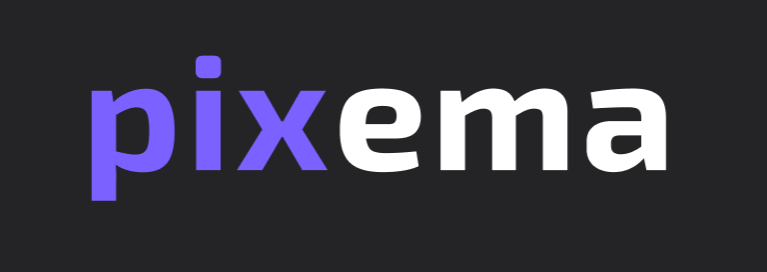
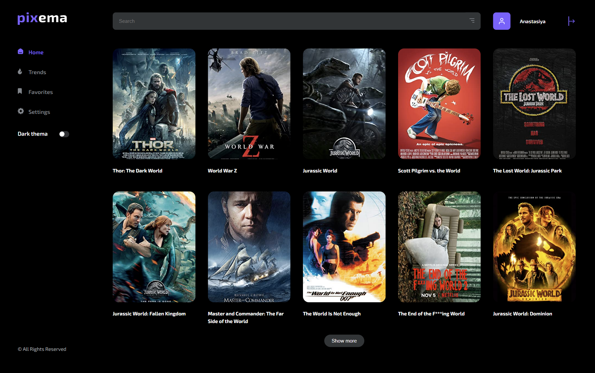
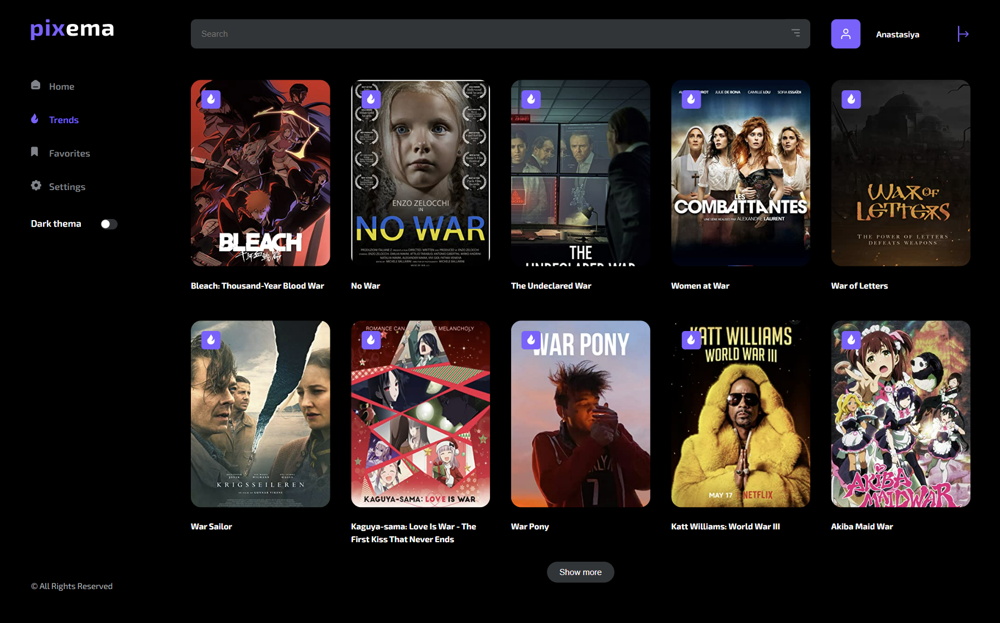
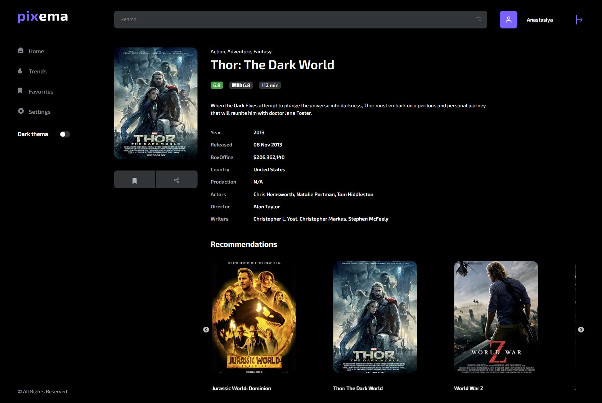
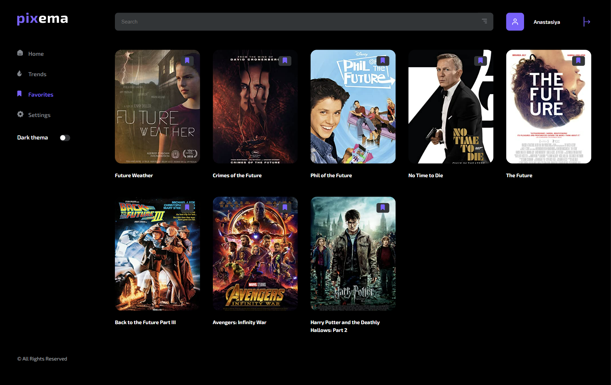
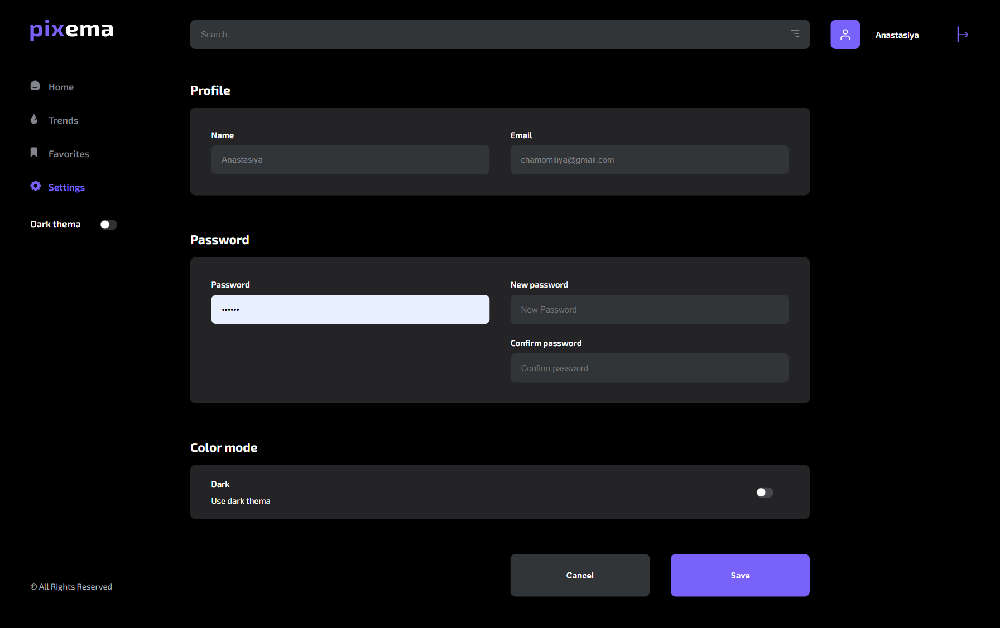
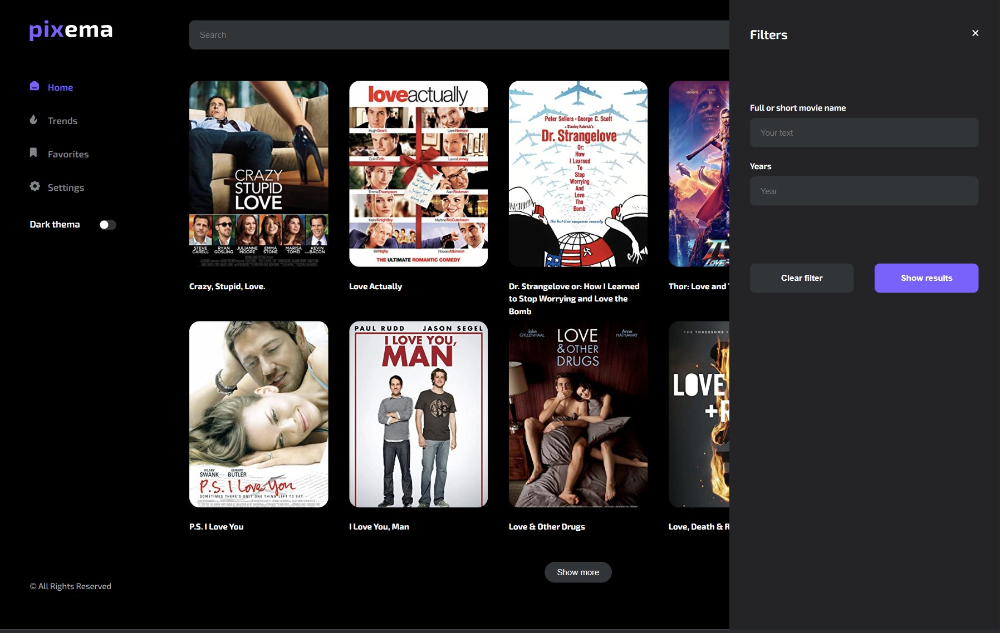

<!-- PROJECT LOGO -->

<div align="center">
<br />
<a href="https://github.com/AnomaliyaK/react-pixema-movies">
    
  </a>
   <h3 align="center">PIXEMA</h3>
  <p align="center">
    Your assistant in choosing the best movie to watch
    <br />
    <br />
    <!--  -->
     Сlick <a href="https://anomaliyak.github.io/react-pixema-movies/">here</a> and start searching!
    <br />
  </p>
</div>

<!-- ABOUT THE PROJECT -->

## About The Project

Pixema has an extensive library of feature films, documentaries, anime and others. Search as much as you want, anytime and everywhere you want.

### Built With

- [![React][react.js]][react-url]
- [![React Router][reactrouter.com]][react-router-url]
- [![Redux Toolkit][redux-toolkit.js.org]][redux-url]
- [![React Hook Form][react-hook-form.com]][react-hook-form-url]
- [![Axios][axios-http.com]][axios-url]
- [![Firebase][firebase.google.com]][firebase-url]
- [![styled-components][styled-components]][styled-components-url]
- [![Typescript
][typescriptlang.org]][typescriptlang-url]

<!-- GETTING STARTED -->

## Getting Started

To get started use the `npm start`.

### Prerequisites

To install all libraries use the `npm install`.

### Installation

If you want to use the local copy:

1. Clone the repo
   ```sh
   git clone https://github.com/AnomaliyaK/react-pixema-movies
   ```
2. Install NPM packages
   ```sh
   npm install
   ```

## Usage

After loading site you can see Home Page.



You can see movie trends.



If you click on the movie card, you will see detailed information about selected film. On this page there are some similar movie recommendations. Registered users can add the movie to their favorites.



If you sign up, you can add any movies to your favorites and see all of them on favorites page.



Settings page provides an opportunity to change your name, email and password.
You can also set your favorite theme: light or dark.



If you open filters, you can search movie by title and year of release.



<!-- CONTACT -->

## Contact

Anastasiya Kachan
<br />
Email: kachan.fe.dev@gmail.com
<br />
LinkedIn: [https://www.linkedin.com/in/anastasiya-kachan-bb838a256/]
<br />
Project Link: [https://github.com/AnomaliyaK/react-pixema-movies]

<!-- MARKDOWN LINKS & IMAGES -->
<!-- https://www.markdownguide.org/basic-syntax/#reference-style-links -->

[contributors-shield]: https://img.shields.io/github/contributors/othneildrew/Best-README-Template.svg?style=for-the-badge
[contributors-url]: https://github.com/othneildrew/Best-README-Template/graphs/contributors
[forks-shield]: https://img.shields.io/github/forks/othneildrew/Best-README-Template.svg?style=for-the-badge
[forks-url]: https://github.com/othneildrew/Best-README-Template/network/members
[stars-shield]: https://img.shields.io/github/stars/othneildrew/Best-README-Template.svg?style=for-the-badge
[stars-url]: https://github.com/othneildrew/Best-README-Template/stargazers
[issues-shield]: https://img.shields.io/github/issues/othneildrew/Best-README-Template.svg?style=for-the-badge
[issues-url]: https://github.com/othneildrew/Best-README-Template/issues
[license-shield]: https://img.shields.io/github/license/othneildrew/Best-README-Template.svg?style=for-the-badge
[license-url]: https://github.com/othneildrew/Best-README-Template/blob/master/LICENSE.txt
[linkedin-shield]: https://img.shields.io/badge/-LinkedIn-black.svg?style=for-the-badge&logo=linkedin&colorB=555
[linkedin-url]: https://linkedin.com/in/othneildrew
[product-screenshot]: images/screenshot.png
[next.js]: https://img.shields.io/badge/next.js-000000?style=for-the-badge&logo=nextdotjs&logoColor=white
[next-url]: https://nextjs.org/
[react.js]: https://img.shields.io/badge/React-20232A?style=for-the-badge&logo=react&logoColor=61DAFB
[react-url]: https://reactjs.org/
[vue.js]: https://img.shields.io/badge/Vue.js-35495E?style=for-the-badge&logo=vuedotjs&logoColor=4FC08D
[vue-url]: https://vuejs.org/
[angular.io]: https://img.shields.io/badge/Angular-DD0031?style=for-the-badge&logo=angular&logoColor=white
[angular-url]: https://angular.io/
[svelte.dev]: https://img.shields.io/badge/Svelte-4A4A55?style=for-the-badge&logo=svelte&logoColor=FF3E00
[svelte-url]: https://svelte.dev/
[laravel.com]: https://img.shields.io/badge/Laravel-FF2D20?style=for-the-badge&logo=laravel&logoColor=white
[laravel-url]: https://laravel.com
[bootstrap.com]: https://img.shields.io/badge/Bootstrap-563D7C?style=for-the-badge&logo=bootstrap&logoColor=white
[bootstrap-url]: https://getbootstrap.com
[jquery.com]: https://img.shields.io/badge/jQuery-0769AD?style=for-the-badge&logo=jquery&logoColor=white
[jquery-url]: https://jquery.com
[typescriptlang-url]: https://www.typescriptlang.org/
[react-hook-form-url]: https://react-hook-form.com/
[react-select-url]: https://react-select.com/home
[styled-components-url]: https://styled-components.com/
[contributors-shield]: https://img.shields.io/github/contributors/Alissse271/kinopoisk-clone.svg?style=for-the-badge
[contributors-url]: https://github.com/Alissse271/kinopoisk-clone/graphs/contributors
[forks-shield]: https://img.shields.io/github/forks/Alissse271/kinopoisk-clone.svg?style=for-the-badge
[forks-url]: https://github.com/Alissse271/kinopoisk-clone/network/members
[stars-shield]: https://img.shields.io/github/stars/Alissse271/kinopoisk-clone.svg?style=for-the-badge
[stars-url]: https://github.com/Alissse271/kinopoisk-clone/stargazers
[linkedin-shield]: https://img.shields.io/badge/-LinkedIn-black.svg?style=for-the-badge&logo=linkedin&colorB=555
[linkedin-url]: https://www.linkedin.com/in/alisa-gusarova/
[typescriptlang.org]: https://img.shields.io/badge/-Typescript-blue?style=for-the-badge&logo=typescript&logoColor=white
[typescript-url]: https://www.typescriptlang.org/
[react.js]: https://img.shields.io/badge/React-20232A?style=for-the-badge&logo=react&logoColor=61DAFB
[react-url]: https://reactjs.org/
[axios-http.com]: https://img.shields.io/badge/-axios-671ddf?style=for-the-badge&logo=axios&logoColor=white
[axios-url]: https://axios-http.com/ru/docs/intro
[firebase.google.com]: https://img.shields.io/badge/-firebase-5f6368?style=for-the-badge&logo=firebase&logoColor=orange
[firebase-url]: https://firebase.google.com/docs/
[redux-toolkit.js.org]: https://img.shields.io/badge/-redux--toolkit-764abc?style=for-the-badge&logo=redux&logoColor=white
[redux-url]: https://redux-toolkit.js.org/
[react-hook-form.com]: https://img.shields.io/badge/-react--hook--form-1e2a4a?style=for-the-badge&logo=react-hook-form&logoColor=ec5990
[react-hook-form-url]: https://react-hook-form.com/
[framer.com]: https://img.shields.io/badge/-framer--motion-DD0031?style=for-the-badge&logo=framer&logoColor=black
[framer-url]: https://www.framer.com/
[reactrouter.com]: https://img.shields.io/badge/React_Router-CA4245?style=for-the-badge&logo=react-router&logoColor=white
[react-router-url]: https://reactrouter.com/
[styled-components]: https://img.shields.io/badge/styled--components-DB7093?style=for-the-badge&logo=styled-components&logoColor=white
[styled-components-url]: https://styled-components.com/
[omdbapi.com]: https://img.shields.io/badge/-OMDb%20API%20-blue
[omdb-api-url]: http://www.omdbapi.com/
